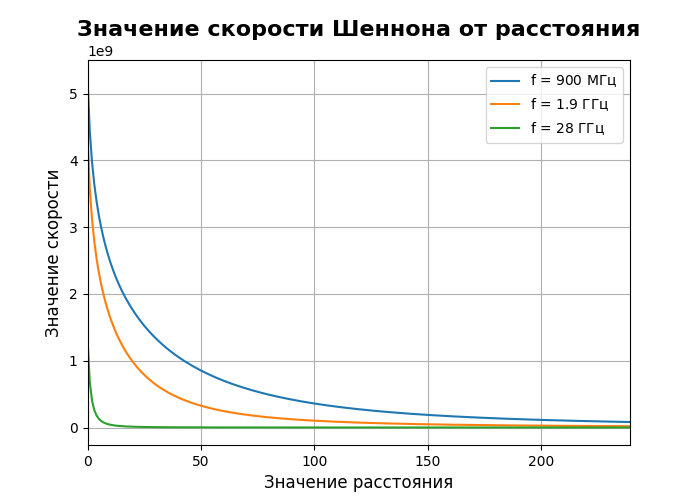
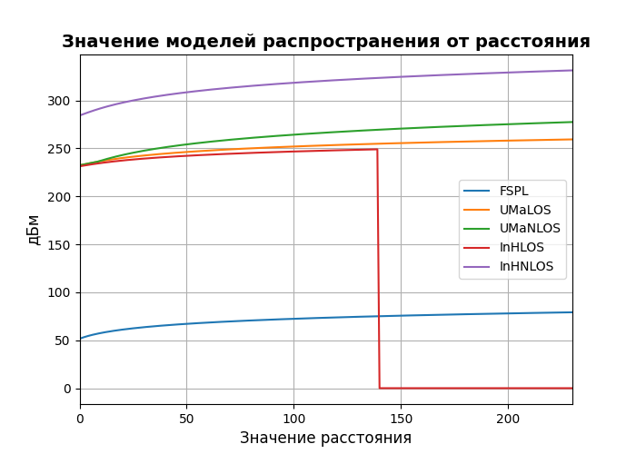
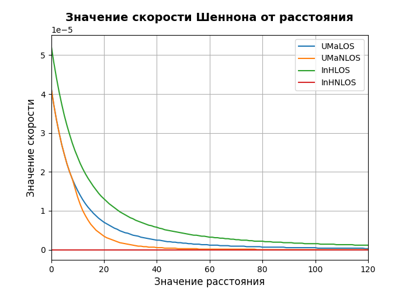
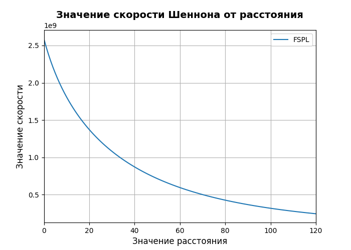

# Задание 1 

## Зависимость от частоты

Скорость Шеннона: 364413740.006, f = 900000000 Гц, усил = 10 дБ, Pt = 23 дБм

Скорость Шеннона: 104029414.346, f = 1900000000 Гц, усил = 10 дБ, Pt = 23 дБм

Скорость Шеннона: 524665.749, f = 28000000000 Гц, усил = 10 дБ, Pt = 23 дБм

## Зависимость от усиления

Скорость Шеннона: 364413740.006, f = 900000000 Гц, усил = 10 дБ, Pt = 23 дБм

Скорость Шеннона: 1317344176.916, f = 900000000 Гц, усил = 15 дБ, Pt = 23 дБм

Скорость Шеннона: 2590548252.252, f = 900000000 Гц, усил = 20 дБ, Pt = 23 дБм

## Зависимость от Pt

Скорость Шеннона: 364413740.006, f = 900000000 Гц, усил = 10 дБ, Pt = 23 дБм

Скорость Шеннона: 504089566.3, f = 900000000 Гц, усил = 10 дБ, Pt = 25 дБм

Скорость Шеннона: 974509326.764, f = 900000000 Гц, усил = 10 дБ, Pt = 30 дБм

## График зависимости скорости по Шенону от расстояния 

# Задание 2 

# Задание 3 

